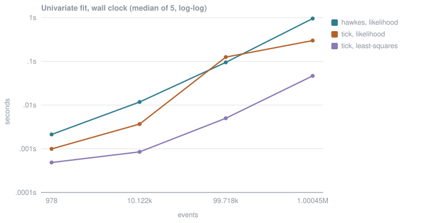
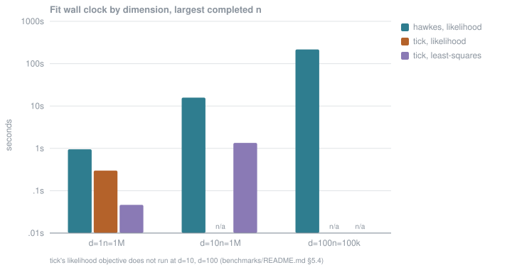

# hawkes

Multivariate Hawkes processes in Rust: simulation and maximum-likelihood estimation,
with Python bindings.

> ## Pre-alpha
>
> The exponential-kernel process works in one and `d` dimensions: simulation,
> log-likelihood, analytic gradient and maximum-likelihood fitting, from Rust and from
> Python. The API will change.
>
> Every formula traces to an approved derivation in [`docs/derivations/`](docs/derivations),
> and every oracle has been deliberately broken and observed going red before being
> trusted — see [`docs/verification-log.md`](docs/verification-log.md).

## What this is for

The library's only real product is **correct numbers**. A fast library that returns
subtly wrong parameter estimates is worse than nothing, because users cannot tell.

**`hawkes` is not the fastest option.** On the univariate fit `tick` is
3.18x faster at a million events, and on its own default objective it is faster
still. Those numbers are below, first, with the conditions they were measured under.
`hawkes` exists for reasons that are not speed, and each of them is measured rather than
claimed.

## Install

Neither package is published yet; this is pre-alpha and the API will change.

The distribution is named **`hawkes-rs`** on both registries because `hawkes` is taken
on PyPI by an unrelated package. What you import is **`hawkes`**: `use hawkes::…` in
Rust, `import hawkes` in Python.

```sh
# Rust
cargo add --git https://github.com/melihakpinar/hawkes-rs hawkes-rs

# Python — build the wheel from a checkout
pip install maturin && maturin build --release --manifest-path hawkes-python/Cargo.toml
pip install target/wheels/hawkes_rs-*.whl
```

## Quickstart

Both programs below are committed, compiled and run by CI, and print the same numbers.
Rust: [`hawkes/examples/quickstart.rs`](hawkes/examples/quickstart.rs). Python:
[`hawkes-python/examples/quickstart.py`](hawkes-python/examples/quickstart.py).

```rust
use hawkes::univariate::{Observation, Parameters, fit, simulate};
use rand::SeedableRng;
use rand_chacha::ChaCha8Rng;

let truth = Parameters::new(0.5, 0.6, 1.0)?;      // baseline, excitation, decay

// The horizon is supplied, never inferred from the events.
let horizon = 20_000.0;
let mut rng = ChaCha8Rng::seed_from_u64(7);
let times = simulate(&truth, horizon, &mut rng)?;

let observation = Observation::new(&times, horizon)?;
let result = fit(&observation)?;
println!("{:.4}", result.parameters.baseline());          // 0.5041
println!("{}", result.parameters.is_stationary());        // true
```

```python
import numpy as np
from hawkes import univariate

truth = univariate.Parameters(baseline=0.5, excitation=0.6, decay=1.0)

horizon = 20_000.0
times = univariate.simulate(truth, horizon, seed=7)

fit = univariate.fit(times, horizon)
print(f"{fit.parameters.baseline:.4f}")     # 0.5041
print(fit.is_stationary())                  # True
```

Both print `24899 events`, a baseline of `0.5041`, an excitation of `0.5951` and a decay
of `0.9852`, against true values of `0.5`, `0.6` and `1.0`.

The multivariate API has the same shape; see
[`hawkes-python/examples/fit_multivariate.py`](hawkes-python/examples/fit_multivariate.py).

## Benchmarks

Methodology was fixed and committed **before any number was produced**:
[`benchmarks/README.md`](benchmarks/README.md). Every figure below comes from a
committed JSON file in [`benchmarks/results/`](benchmarks/results), and every one was
measured on an Apple M2, single-threaded on both sides, as the median of 5 timed runs
after a discarded warmup, with both libraries fitting exactly the same events.

Three differences could not be equalised and all three favour `tick`: it is handed the
true `beta` rather than estimating it, its objective carries an L2 penalty, and its
stopping criterion is not the same kind of criterion. They are set out in
`benchmarks/README.md` §5.

### Where `tick` wins

`benchmarks/results/fit-d1.json`. Seconds; ratio is `hawkes / tick`.

| events | hawkes | hawkes [min, max] | tick, likelihood | ratio | tick, least-squares | ratio |
| --- | --- | --- | --- | --- | --- | --- |
| 978 | 0.0021 | [0.0021, 0.0025] | 0.0010 | 2.14x | 0.0005 | 4.39x |
| 10,122 | 0.0117 | [0.0102, 0.0155] | 0.0037 | 3.19x | 0.0008 | 13.83x |
| 99,718 | 0.0946 | [0.0943, 0.1015] | 0.1248 | 0.76x | 0.0050 | 18.97x |
| 1,000,453 | 0.9509 | [0.9463, 0.9621] | 0.2987 | 3.18x | 0.0464 | 20.49x |

Both answers under `hawkes`'s unpenalized negative log-likelihood, so two objectives sit in one unit. Lower is better; the last two columns are how much worse `tick`'s answer scores.

| events | hawkes nll | tick, likelihood | tick, least-squares |
| --- | --- | --- | --- |
| 978 | 625.5910 | +0.0771 | +0.9065 |
| 10,122 | 6223.7778 | +0.0042 | +0.0037 |
| 99,718 | 62179.6493 | +0.0001 | +0.1475 |
| 1,000,453 | 622144.1427 | +1.3004 | +1.3270 |

**`tick` is faster on the univariate fit at every size from 10 000 events up**, by
**3.18x** at a million events. That reproduces the positioning probe's 3.12x. On its own
least-squares default it is faster still — up to **20.49x** — but that is a *different
estimator*, not a faster implementation of the same one, and the second table is how far
its answer sits from the likelihood optimum.

The `n = 99,718` row, where `hawkes` is faster, is **not presented as a win.** It
reproduces across runs (0.76x twice), but `tick`'s 0.1248 s there is **4.4x its own
0.0279 s at the same nominal size in `docs/positioning-probe.md` §7**, measured on the
same machine with the same settings. Something about that cell differs between the two
documents and this repository has not established what. Until it does, the row is
**unexplained**, not evidence.

### Fitting, by dimension

`benchmarks/results/fit-d{1,10,100}.json`. The largest `n` each dimension completed, seconds.

| d | parameters | events | hawkes | tick, likelihood | tick, least-squares |
| --- | --- | --- | --- | --- | --- |
| 1 | 3 | 1,000,453 | 0.9509 | 0.2987 | 0.0464 |
| 10 | 111 | 1,000,453 | 15.7469 | does not run | 1.3444 |
| 100 | 10,101 | 99,718 | 216.6955 | does not run | — |

### `hawkes` does not converge at `d = 100`. This is a limitation.

At 100 components the fit stops at its **1000-iteration cap with `converged = false`**,
a final gradient norm of `3.518e-06` against the `1e-6` threshold. It returns numbers —
a spectral radius of 0.6178 against a true 0.6 — and they should not be read as a
converged estimate.

Two candidate explanations were measured separately rather than assumed
(`benchmarks/results/d100-diagnosis.json`).

**Per-evaluation cost is not the problem.** One `nll`+gradient evaluation, with the event
count held at 99 718 so only `d` varies:

| d | seconds | vs previous | d ratio | implied exponent |
| --- | --- | --- | --- | --- |
| 1 | 0.005810 | — | — | — |
| 3 | 0.004815 | 0.83x | 3.00x | −0.17 |
| 10 | 0.007460 | 1.55x | 3.33x | 0.36 |
| 30 | 0.019732 | 2.64x | 3.00x | 0.89 |
| 100 | 0.061366 | 3.11x | 3.33x | **0.94** |

Cost grows **close to linearly in `d`**, not quadratically. The `d = 1` and `d = 3` points
are dominated by fixed overhead, which is why the exponent settles only from `d = 10`. The
216 s fit is explained by the number of passes, not the cost of each: 1151 objective plus
2151 gradient evaluations is 3302 passes, and 3302 x 0.0614 = 203 s against 217 s
measured. The 14 s difference is not accounted for.

**Non-convergence is a plateau, not a slow descent.** The gradient norm over all 1000
iterations:

| iteration | cost | gradient norm |
| --- | --- | --- |
| 0 | 5.231962207 | 2.32e-03 |
| 100 | 5.180495687 | 5.53e-05 |
| 300 | 5.179870754 | 7.25e-05 |
| 500 | 5.179788571 | 1.21e-05 |
| 800 | 5.179755287 | 5.30e-06 |
| 999 | 5.179748547 | 3.52e-06 |

It reaches `5.5e-05` by iteration 100 and then oscillates between `1.46e-06` and
`9.56e-05` for the remaining 900 without crossing the threshold; the minimum occurs at
iteration 942 and it rises again afterwards. The cost falls by `4.0e-05` over the last 500
iterations. **Raising the iteration cap would not fix this** — the cap is not what binds.

### `tick` returns no result at `d = 100` either

Its least-squares fit was **killed at the 1800 s cell budget** (`benchmarks/README.md`
§4.1), and its likelihood objective does not run through `HawkesExpKern` at any `d > 1`
at all. Neither library produces a usable 100-component fit under this methodology, and
neither is credited with a win there.

### Simulation

`benchmarks/results/simulate.json`. One realization to a fixed horizon. The two use different generators, so the realized counts differ; both are shown.

| d | hawkes events | hawkes | tick events | tick | tick / hawkes |
| --- | --- | --- | --- | --- | --- |
| 1 | 10,118 | 0.0017 | 10,109 | 0.0009 | 0.54x |
| 1 | 100,143 | 0.0098 | 99,766 | 0.0085 | 0.87x |
| 1 | 999,707 | 0.0657 | 999,975 | 0.0857 | 1.31x |
| 10 | 10,118 | 0.0018 | 10,109 | 0.0200 | 11.22x |
| 10 | 100,143 | 0.0176 | 99,766 | 0.1960 | 11.15x |
| 10 | 999,707 | 0.1763 | 999,975 | 2.0195 | 11.45x |

`hawkes` is faster at `d = 10` by about 11x at every size, and at `d = 1` only from roughly
a million events up. Below that `tick` is faster, by 1.8x at ten thousand events.

### Charts

Regenerate every chart from the committed JSON with
`python3 benchmarks/suite/create_diagrams.py`; there is no manual step.





## What `hawkes` does that `tick` does not

Each item is measured, and each links to the evidence. Nothing is claimed here that the
repository does not show.

### It estimates the decay

`tick`'s exponential-kernel estimators take `beta` as a fixed constructor argument;
`HawkesExpKern.decays` echoes back what was passed in. There is no `tick` interface that
treats it as a free parameter. `hawkes` fits `(mu, alpha, beta)`, and the finite-difference
gradient check covers `d/dbeta`, which `tick` cannot check at all.

### It can express an observation window

`HawkesExpKern.fit` takes no `end_times`, so the model falls back to `max(events)`.
`mu` is a rate, so an estimate must fall as the observed window grows; an estimator that
cannot see the window returns the same number regardless.

One realization of 20,382 events, true baseline `0.5`. Only the declared window changes.

| dead time | declared horizon | hawkes baseline | tick baseline |
| --- | --- | --- | --- |
| 0% | 16,000 | 0.5000 | 0.5133 |
| 5% | 16,800 | 0.3982 | 0.5133 |
| 10% | 17,600 | 0.3093 | 0.5133 |
| 25% | 20,000 | 0.0877 | 0.5133 |
| 50% | 24,000 | 0.0004 | 0.5133 |

`tick`'s column is constant because `HawkesExpKern.fit` has no parameter for the window;
that is the structural point and it is the only thing claimed here. Its estimate also
differs from `hawkes`'s by 2.7% at **zero** dead time, and this repository has not
established why, so no claim is made about it.

Measured by [`benchmarks/suite/window_bias.sh`](benchmarks/suite/window_bias.sh),
recorded in [`benchmarks/results/window-bias.json`](benchmarks/results/window-bias.json)
together with the `HawkesExpKern.fit` signature, so the claim is checkable.
Resolved as OQ-5 and recorded as `conventions.md` C5.

### Its multivariate likelihood fit runs at all

At `d > 1`, every deterministic solver `tick` offers with `gofit="likelihood"` leaves the
non-negative region its C++ model requires and raises
`RuntimeError: The sum of the influence on someone cannot be negative`. `sgd` is the only
combination that returns; it warns that its step size needs manual tuning, and against a
true `alpha_ij = 0.06` it returns `0.164`, `0.097`, or `0.000` with the baseline inflated
to `1.69` and `7.39`. The full table is `benchmarks/README.md` §5.4.

`tick`'s least-squares default works everywhere and is fast, which is why it is the
comparison used at `d > 1` above.

### Its loss is the log-likelihood

`tick`'s `ModelHawkesExpKernLogLik.loss` is neither the negative log-likelihood nor the
formula in its own docstring. It is the negative log-likelihood **ratio against a
unit-rate Poisson process**, normalized by `n_jumps`; measured exactly, at
`adjacency == 0`, for `D in {1,2,3}` and several `mu`:

```text
loss * n_jumps - sum_i ( mu_i*T - n_i*log mu_i )  ==  -D*T
```

That identity is what makes the differential test against `tick` possible at all. See
[`docs/open-questions.md`](docs/open-questions.md) OQ-8 and `conventions.md` C7.

### It handles simultaneous events

Ties are handled by pooling **distinct times** across all components, so simultaneous
events do not excite one another. Accumulating per event instead is wrong by about
**1.1%** on the worked counterexample in
[`docs/derivations/multivariate_loglikelihood.md`](docs/derivations/multivariate_loglikelihood.md)
§: the intensity is predictable, and an event cannot contribute to its own intensity.
Four of the eleven committed fixtures contain exact ties for this reason.

### Its stationarity diagnostic is right on reducible matrices

`branching_ratio_spectral_radius` returns the **Collatz–Wielandt upper bound**, not the
midpoint of the bracket. `rho = inf_x max_i (Ax)_i/x_i` holds for every non-negative
matrix, but the matching `sup` form needs irreducibility: on `diag(0.2, 0.7, 0.4)` the
bracket is `[0.2, 0.7]` at every iteration and never closes, and the midpoint would
report `0.45` for a spectral radius of `0.7`.

Stationarity is never enforced during fitting. A non-stationary fit is a real finding
about the data, so it is reported as a diagnostic on the result.
Derivation: [`docs/derivations/spectral_radius.md`](docs/derivations/spectral_radius.md).

## Verification

All five of the oracles `CLAUDE.md` §3 requires are live, plus a brute-force reference.
Each has been observed failing on deliberately broken code before being trusted, and
each sabotage is recorded in [`docs/verification-log.md`](docs/verification-log.md).

- **Brute-force reference** — the `O(n^2)` definition, transcribed rather than optimised,
  validated against hand calculations and the Poisson closed form. The `O(n)` recursion is
  gated against it, relative to the scale of the computation rather than to `|nll|`.
- **Differential test against `tick`** — eleven committed scenarios, four parameter points
  each, agreeing to `1e-9` relative.
- **Round-trip property test** — simulate, fit, recover, with the tolerance derived per
  realization from the observed Fisher information rather than fixed by hand.
- **Finite-difference gradient check** — a wrong derivative still converges, to the wrong
  place, and nothing else catches it.
- **Analytic identity** — the stationary mean intensity, `mu/(1-alpha)` univariately and
  the per-component solve of `(I - alpha) m = mu` in `d` dimensions.
- **Time-rescaling residuals** — Ogata's transform, KS-tested against `Exp(1)` per
  component. Validates the simulator and the compensator jointly.

Two defects in this repository were found only by widening a sabotage that had first
come back green, which is why `CLAUDE.md` §3 now requires it.

### Running the checks

```sh
cargo test --all-features        # --all-features: the rayon-gated tests are skipped without it
cargo clippy --all-targets --all-features -- -D warnings
cargo fmt --check

maturin develop --manifest-path hawkes-python/Cargo.toml
python -m pytest hawkes-python/tests
mypy --strict hawkes-python/python/hawkes hawkes-python/examples
```

Regenerating the fixtures needs Docker; see
[`benchmarks/docker/README.md`](benchmarks/docker/README.md). It is not required to run
the suite — the fixtures are committed.

## Python wheels

`abi3`, built once per platform against CPython 3.9. What follows is what a workflow was
**observed** to do, not what its matrix declares:

| Platform | Wheel built | Loaded by an interpreter |
| --- | --- | --- |
| Linux `x86_64` (manylinux) | yes | yes |
| Linux `aarch64` (manylinux) | yes | yes |
| macOS `arm64` | yes | yes |
| macOS `x86_64` | yes | **no — built, not verified** |
| Windows `AMD64` | yes | yes |

The Linux `x86_64` wheel is installed into CPython 3.9, 3.10, 3.11, 3.12 and 3.13 in an
environment with no Rust toolchain and no source tree, and the full suite is run against
it there. One `cp39-abi3` build serving 3.9 through 3.13 is the span that has been
measured; later interpreters are expected to load it by the `abi3` contract, which is not
the same as having been tested.

**macOS `x86_64` is built, not verified.** It is cross-compiled on the arm64 runner and no
interpreter has ever loaded it, because GitHub's Intel macOS runner is retired — a job
targeting it sat queued for 15 hours 49 minutes without starting while every other leg
started within 6 seconds. It ships because Intel Macs are common enough that an untested
wheel beats none, and it is labelled rather than left to be assumed working. Its floor is
macOS 10.12, Rust's minimum for that target.

musllinux, Windows on ARM and PyPy are not built at all.
Details: [`docs/python-wheels.md`](docs/python-wheels.md).

## How it works

The estimator is Ozaki's `O(n)` recursion, generalised to `d` components by pooling
distinct event times. Optimization is L-BFGS in log-parameter space, so the positivity
constraints are handled by the parametrization rather than by a constrained solver.

Every formula was derived and approved before it was implemented, and the derivations are
the specification:

| Document | What it fixes |
| --- | --- |
| [`conventions.md`](docs/derivations/conventions.md) | kernel normalization, branching ratio, sum bounds, compensator tail, window, index order, ties |
| [`univariate_loglikelihood.md`](docs/derivations/univariate_loglikelihood.md) | the `O(n)` recursion and its gate |
| [`univariate_gradient.md`](docs/derivations/univariate_gradient.md) | the analytic gradient |
| [`multivariate_loglikelihood.md`](docs/derivations/multivariate_loglikelihood.md) | `d` components, cross-excitation, the tie rule |
| [`multivariate_gradient.md`](docs/derivations/multivariate_gradient.md) | the `d`-dimensional gradient |
| [`parameter_space.md`](docs/derivations/parameter_space.md) | the log-space transform |
| [`spectral_radius.md`](docs/derivations/spectral_radius.md) | the stationarity diagnostic |

The kernel is `alpha * beta * exp(-beta * t)`, so it integrates to `alpha` and the
branching ratio **is** `alpha`. The other convention in the literature gives a different
meaning to `alpha`; the choice is pinned by experiment in `conventions.md` C1 against
`tick`, not by preference.

## Reproducing the benchmarks

```sh
benchmarks/suite/fit_d1.sh
benchmarks/suite/fit_d10.sh
benchmarks/suite/fit_d100.sh
benchmarks/suite/simulate.sh
benchmarks/suite/window_bias.sh
python3 benchmarks/suite/create_diagrams.py
```

Each is standalone: it builds what it needs, creates a virtual environment with the
pinned `tick`, and writes JSON to `benchmarks/results/`. Timings are machine-specific;
the JSON records the hardware and the full spread, not just the median.

## Layout

```
hawkes/                  Rust core crate
hawkes-python/           PyO3 bindings, maturin
docs/
  derivations/         approved derivations; conventions.md pins the index conventions
  references/          papers (PDFs are not committed; see the README there for sources)
  open-questions.md    OQ-1 to OQ-11, all resolved, each with the evidence that settled it
  verification-log.md  proof that each oracle goes red when the code is broken
  positioning-probe.md the univariate timing probe M4's benchmarks build on
benchmarks/
  README.md            methodology, fixed before any number was produced
  docker/              pinned tick environment and the fixture generator
  suite/               one runnable script per benchmark
  results/             committed JSON
tests/fixtures/        committed reference data from tick
```

## Status

| Milestone | Contents | State |
| --- | --- | --- |
| M0 | Verification infrastructure: pinned `tick` oracle, reference fixtures, differential / property / gradient harnesses, sabotage evidence | complete |
| M1 | Univariate exponential-kernel likelihood, gradient, simulator, MLE | complete |
| M2 | Multivariate with cross-excitation | complete |
| M3 | Python bindings and wheels | complete |
| M4 | Benchmarks against `tick`, and this README | complete |

Out of scope for v0.1.0, deliberately and without hooks left in preparation:
sum-of-exponentials and power-law kernels, non-parametric estimation, L1/nuclear
regularization, marked and spatial processes, GPU, async.

## Licence

Dual-licensed under [MIT](LICENSE-MIT) or [Apache 2.0](LICENSE-APACHE), at your option.
