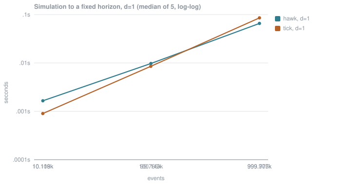

# hawkes-rs

[](#licence)
[](https://pypi.org/project/hawkes-rs/)
[](https://crates.io/crates/hawkes-rs)

**Observe a process for 16 000 time units or for 24 000 with nothing in the last third, and
`tick` returns the same baseline both times — 0.5133 — because its learner has no parameter
for the observation window. `hawkes-rs` takes the window as an argument, and the estimate
follows it: 0.5000 down to 0.0004.**

It is not faster. On the univariate fit `tick` beats it **3.18x** at a million events, and
by up to **20.49x** on `tick`'s own least-squares default. Those numbers are below, first,
with the conditions they were measured under.

Multivariate Hawkes processes in Rust — simulation, log-likelihood, analytic gradient and
maximum-likelihood estimation — with Python bindings. Every formula was derived and approved
before it was implemented, and every oracle has been deliberately broken and observed going
red before being trusted.

- **It estimates the decay.** `tick` takes `beta` as a fixed constructor argument; no `tick`
  interface treats it as free. Here it is fitted along with the rest, and the
  finite-difference gradient check covers `d/dbeta`.
- **It can express an observation window.** `[0, T]` is supplied by the caller and never
  inferred from the events, so a window with trailing dead time gives a lower rate rather
  than the same one.
- **Its multivariate likelihood fit runs.** At `d > 1` every deterministic solver `tick`
  offers under `gofit="likelihood"` leaves the non-negative region its C++ model requires
  and raises.
- **Its loss is the log-likelihood.** `tick`'s `ModelHawkesExpKernLogLik.loss` is neither the
  negative log-likelihood nor the formula in its own docstring.
- **It handles simultaneous events.** Ties are pooled by distinct time, so an event cannot
  excite itself. Accumulating per event instead is wrong by 1.1% on a worked counterexample.

If you need parameter estimates you can defend — the decay fitted rather than assumed, the
window stated rather than inferred, and an audit trail behind every number — this is built
for that. If you need the fastest univariate fit, use `tick`.

## Python

```sh
pip install hawkes-rs
```

```python
import numpy as np
from hawkes import univariate

truth = univariate.Parameters(baseline=0.5, excitation=0.6, decay=1.0)

horizon = 20_000.0                                   # supplied, never inferred
times = univariate.simulate(truth, horizon, seed=7)

fit = univariate.fit(times, horizon)
print(len(times), fit.parameters.baseline, fit.parameters.decay)
print(fit.branching_ratio(), fit.is_stationary())
```

Prints `24899` events, a baseline of `0.5041`, an excitation of `0.5951` and a decay of
`0.9852`, against true values of `0.5`, `0.6` and `1.0`. The multivariate API has the same
shape: [`fit_multivariate.py`](hawkes-python/examples/fit_multivariate.py).

## Rust

```sh
cargo add hawkes-rs
```

```rust
use hawkes::univariate::{Observation, Parameters, fit, simulate};
use rand::SeedableRng;
use rand_chacha::ChaCha8Rng;

let truth = Parameters::new(0.5, 0.6, 1.0)?;

let horizon = 20_000.0;                              // supplied, never inferred
let mut rng = ChaCha8Rng::seed_from_u64(7);
let times = simulate(&truth, horizon, &mut rng)?;

let result = fit(&Observation::new(&times, horizon)?)?;
println!("{:.4}", result.parameters.baseline());     // 0.5041
println!("{}", result.parameters.is_stationary());   // true
```

The example needs `rand` alongside it, and the version is not free to choose:

```sh
cargo add rand@0.9 rand_chacha@0.9
```

`simulate` takes an `impl rand::Rng`, so `rand` is part of the public signature and a
caller's copy has to be the major version this was built against. A bare `cargo add rand`
resolves to 0.10 and fails on the trait bound. That coupling is a design problem rather
than a documentation one — it makes every future `rand` release a breaking change for
callers — and it is [#42](https://github.com/melihakpinar/hawkes-rs/issues/42), to be
settled in v0.2 while the API is still pre-alpha.

Both programs are committed, compiled and run by CI, and print identical figures:
[`quickstart.rs`](hawkes/examples/quickstart.rs),
[`quickstart.py`](hawkes-python/examples/quickstart.py). Both were re-run from the published
packages in a clean environment with no source tree present.

## Fitting

Methodology was fixed and committed before any number was produced:
[`benchmarks/README.md`](benchmarks/README.md). Apple M2, single-threaded on both sides,
median of 5 timed runs after a discarded warmup, both libraries fitting exactly the same
events. Three asymmetries could not be equalised and all three favour `tick`: it is handed
the true `beta` rather than estimating it, its objective carries an L2 penalty, and its
stopping criterion is not the same kind of criterion.


Both ratio columns are **hawkes-rs / tick**: below 1 means `hawkes-rs` is faster, above 1
means `tick` is. Every ratio in this README reads that way.

| events | hawkes-rs | tick, likelihood | hawkes-rs / tick | tick, least-squares | hawkes-rs / tick |
| --- | --- | --- | --- | --- | --- |
| 978 | 0.0021 | 0.0010 | 2.14x | 0.0005 | 4.39x |
| 10,122 | 0.0117 | 0.0037 | 3.19x | 0.0008 | 13.83x |
| 99,718 | 0.0946 | 0.1248 | 0.76x | 0.0050 | 18.97x |
| 1,000,453 | 0.9509 | 0.2987 | 3.18x | 0.0464 | 20.49x |

Both answers scored under `hawkes-rs`'s unpenalized negative log-likelihood, so two
objectives sit in one unit. Lower is better; the columns are how much worse `tick`'s answer
scores under it.

| events | hawkes-rs nll | tick, likelihood | tick, least-squares |
| --- | --- | --- | --- |
| 978 | 625.5910 | +0.0771 | +0.9065 |
| 10,122 | 6223.7778 | +0.0042 | +0.0037 |
| 99,718 | 62179.6493 | +0.0001 | +0.1475 |
| 1,000,453 | 622144.1427 | +1.3004 | +1.3270 |

Raw: [`fit-d1.json`](benchmarks/results/fit-d1.json).

### By dimension


| d | parameters | events | hawkes-rs | tick, likelihood | tick, least-squares |
| --- | --- | --- | --- | --- | --- |
| 1 | 3 | 1,000,453 | 0.9509 | 0.2987 | 0.0464 |
| 10 | 111 | 1,000,453 | 15.7469 | does not run | 1.3444 |
| 100 | 10,101 | 99,718 | 216.6955 | does not run | not completed |

At `d > 1` the comparison is against `tick`'s least-squares default, a different estimator,
because its likelihood path does not run there at all. At `d = 100` its least-squares fit was
killed at the 1800 s cell budget.

Raw: [`fit-d10.json`](benchmarks/results/fit-d10.json),
[`fit-d100.json`](benchmarks/results/fit-d100.json).

### `hawkes-rs` does not converge at `d = 100`. This is a limitation.

With 10 101 parameters the fit stops at its 1000-iteration cap with `converged = false` and a
final gradient norm of `3.518e-06` against the `1e-6` threshold. It returns numbers — a
spectral radius of 0.6178 against a true 0.6 — and they are not a converged estimate.

Two candidate causes were measured apart rather than assumed. **Per-evaluation cost is not
the problem:** with events held at 99 718, one `nll`+gradient evaluation costs 0.005810 s at
`d = 1` and 0.061366 s at `d = 100`, an implied exponent of **0.94** from `d = 30` to
`d = 100` — close to linear, not quadratic. The 216 s comes from 3302 passes, not slow ones.
**Non-convergence is a plateau, not a slow descent:** the gradient norm reaches `5.53e-05` by
iteration 100, then oscillates between `1.46e-06` and `9.56e-05` for the remaining 900 while
the cost falls by `4.0e-05`. Raising the cap would not fix it.

Raw: [`d100-diagnosis.json`](benchmarks/results/d100-diagnosis.json).

## Simulation

Ogata thinning to a fixed horizon, same protocol. The two libraries use different random
number generators, so realized counts differ and the comparison is per event.



| d | events | hawkes-rs | tick | hawkes-rs / tick |
| --- | --- | --- | --- | --- |
| 1 | 10,118 | 0.0017 | 0.0009 | 1.84x |
| 1 | 100,143 | 0.0098 | 0.0085 | 1.14x |
| 1 | 999,707 | 0.0657 | 0.0857 | 0.77x |
| 10 | 10,118 | 0.0018 | 0.0200 | 0.09x |
| 10 | 100,143 | 0.0176 | 0.1960 | 0.09x |
| 10 | 999,707 | 0.1763 | 2.0195 | 0.09x |

Raw: [`simulate.json`](benchmarks/results/simulate.json).

## The observation window

One realization of 20 382 events, true baseline `0.5`. The events never change; only the
length of the window the caller declares was observed. `mu` is a rate, so the estimate must
fall as the window grows.

| dead time | declared horizon | hawkes-rs | tick |
| --- | --- | --- | --- |
| 0% | 16,000 | 0.5000 | 0.5133 |
| 5% | 16,800 | 0.3982 | 0.5133 |
| 10% | 17,600 | 0.3093 | 0.5133 |
| 25% | 20,000 | 0.0877 | 0.5133 |
| 50% | 24,000 | 0.0004 | 0.5133 |

`tick`'s column is constant because `HawkesExpKern.fit` takes no window; its signature is
recorded alongside the numbers so the claim is checkable. It also differs by 2.7% at **zero**
dead time, and this repository has not established why, so nothing is claimed about that.

Raw: [`window-bias.json`](benchmarks/results/window-bias.json).

## Where `tick` wins

Named here rather than left to be found.

- **The univariate fit, at every size from 10 000 events up.** 3.18x at a million,
  reproducing the positioning probe's 3.12x. The probe decomposes the gap into a 1.61x
  per-pass cost and 36 passes against 23.
- **The univariate fit on its least-squares default, at every size.** Up to 20.49x. A
  different estimator, and the nll table shows what its answer costs — but if least squares
  is what you want, it is much faster.
- **Simulation at `d = 1` below roughly a million events.** 1.84x at ten thousand, near
  parity at a hundred thousand, and reversing to 0.77x at a million.
- **`d = 100`, where neither library produces a usable fit.** `tick` returns nothing;
  `hawkes-rs` returns a number that has not converged. Nobody wins this one.

The `n = 99,718` cell above, where `hawkes-rs` is faster, is **not** presented as a win. It
reproduces across runs at 0.76x, but `tick`'s 0.1248 s there is 4.4x its own 0.0279 s at the
same nominal size in [`docs/positioning-probe.md`](docs/positioning-probe.md) §7. The cause
is unexplained.

## How it works

1. **An event makes the next one likelier.** The intensity is a baseline rate `mu` plus a
   kick from every event so far, and each kick decays exponentially at rate `beta`. Fitting
   means finding the `mu`, the kick size `alpha`, and the decay that make the observed
   timestamps most probable.

2. **The naive likelihood is quadratic; this one is linear.** Written directly, every event's
   intensity sums over all earlier events — `O(n^2)`. Ozaki's recursion carries the sum
   forward as one running number, so a pass costs `O(n)`. The `O(n^2)` form is kept as a test
   oracle, not as the implementation.

3. **Simultaneous events do not excite each other.** Real data has ties. The recursion is
   advanced once per *distinct time* rather than once per event, because the intensity is
   predictable — an event cannot contribute to the intensity that produced it. Advancing per
   event instead is wrong by 1.1% on a four-event example.

4. **Positivity is handled by the parametrization.** `mu`, `alpha` and `beta` must be
   positive. Rather than constrain the optimizer, the fit runs in log space and converts at
   the boundary, so no iterate can be invalid.

5. **The gradient is analytic and checked against finite differences.** A wrong derivative
   still converges — to the wrong place — and nothing except this catches it.

6. **Stationarity is reported, not enforced.** A fitted process can be explosive; that is a
   finding about the data, not an error. The diagnostic is the spectral radius of the
   excitation matrix, computed as the Collatz–Wielandt **upper** bound rather than the
   bracket midpoint, because on a reducible matrix like `diag(0.2, 0.7, 0.4)` the bracket is
   `[0.2, 0.7]` at every iteration and never closes — the midpoint would report 0.45 for a
   radius of 0.7.

Each step traces to an approved derivation:
[`conventions.md`](docs/derivations/conventions.md) (kernel normalization, sum bounds,
compensator tail, window, index order, ties),
[`univariate_loglikelihood.md`](docs/derivations/univariate_loglikelihood.md),
[`univariate_gradient.md`](docs/derivations/univariate_gradient.md),
[`multivariate_loglikelihood.md`](docs/derivations/multivariate_loglikelihood.md),
[`multivariate_gradient.md`](docs/derivations/multivariate_gradient.md),
[`parameter_space.md`](docs/derivations/parameter_space.md),
[`spectral_radius.md`](docs/derivations/spectral_radius.md).

The kernel is `alpha * beta * exp(-beta * t)`, so it integrates to `alpha` and the branching
ratio **is** `alpha`. The other convention in the literature gives `alpha` a different
meaning; the choice is pinned by experiment against `tick`, not by preference.

## Verification

All five oracles `CLAUDE.md` §3 requires are live, plus a brute-force reference. Each has
been observed failing on deliberately broken code before being trusted, and every sabotage is
recorded in [`docs/verification-log.md`](docs/verification-log.md).

- **Brute-force reference** — the `O(n^2)` definition, transcribed rather than optimised,
  validated against hand calculations and the Poisson closed form. The `O(n)` recursion is
  gated against it, relative to the scale of the computation rather than to `|nll|`.
- **Differential test against `tick`** — eleven committed scenarios, four parameter points
  each, agreeing to `1e-9` relative.
- **Round-trip property test** — simulate, fit, recover, with the tolerance derived per
  realization from the observed Fisher information rather than fixed by hand.
- **Finite-difference gradient check** — including `d/dbeta`, which `tick` cannot check.
- **Analytic identity** — `mu/(1-alpha)` univariately, and the per-component solve of
  `(I - alpha) m = mu` in `d` dimensions.
- **Time-rescaling residuals** — Ogata's transform, KS-tested against `Exp(1)` per component,
  validating the simulator and the compensator jointly.

Two defects were found only by widening a sabotage that had first come back green, which is
why `CLAUDE.md` §3 now requires it.

## Python wheels

`abi3`, built once per platform against CPython 3.9. What follows is what a workflow was
**observed** to do, not what its matrix declares:

| Platform | Wheel built | Loaded by an interpreter |
| --- | --- | --- |
| Linux `x86_64` (manylinux) | yes | yes |
| Linux `aarch64` (manylinux) | yes | yes |
| macOS `arm64` | yes | yes |
| macOS `x86_64` | yes | **no — built, not verified** |
| Windows `AMD64` | yes | yes |

**macOS `x86_64` is built, not verified.** It is cross-compiled on the arm64 runner and no
interpreter has ever loaded it, because GitHub's Intel macOS runner is retired — a job
targeting it sat queued for 15 hours 49 minutes without starting while every other leg
started within 6 seconds. Its floor is macOS 10.12, Rust's minimum for that target.

The Linux `x86_64` wheel is installed into CPython 3.9 through 3.13 in an environment with no
Rust toolchain and no source tree, and the full suite runs against it there. musllinux,
Windows on ARM and PyPy are not built. Details:
[`docs/python-wheels.md`](docs/python-wheels.md).

## Building

```sh
# Rust
cargo build --release

# Python
pip install maturin
maturin develop --manifest-path hawkes-python/Cargo.toml
```

### Running the checks

```sh
cargo test --all-features        # --all-features: the rayon-gated tests are skipped without it
cargo clippy --all-targets --all-features -- -D warnings
cargo fmt --check

python -m pytest hawkes-python/tests
mypy --strict hawkes-python/python/hawkes hawkes-python/examples
```

Regenerating the fixtures needs Docker; see
[`benchmarks/docker/README.md`](benchmarks/docker/README.md). It is not required to run the
suite — the fixtures are committed.

### Running benchmarks

```sh
benchmarks/suite/fit_d1.sh
benchmarks/suite/fit_d10.sh
benchmarks/suite/fit_d100.sh
benchmarks/suite/simulate.sh
benchmarks/suite/window_bias.sh

python3 benchmarks/suite/create_diagrams.py    # charts, from the committed JSON
python3 benchmarks/suite/readme_tables.py      # the tables above, from the same JSON
```

Each script is standalone: it builds what it needs, creates a virtual environment with the
pinned `tick`, and writes JSON to `benchmarks/results/`. Timings are machine-specific; the
JSON records the hardware and the full spread, not just the median.

## Layout

```
hawkes/                Rust core crate
hawkes-python/         PyO3 bindings, maturin
docs/
  derivations/         approved derivations; conventions.md pins the index conventions
  references/          papers. PDFs are not committed: they are copyrighted and
                       redistributing them is not ours to do. The README there names
                       each paper and where to obtain it.
  open-questions.md    OQ-1 to OQ-11, all resolved, each with the evidence that settled it
  verification-log.md  proof that each oracle goes red when the code is broken
  positioning-probe.md the univariate timing probe the benchmarks build on
benchmarks/
  README.md            methodology, fixed before any number was produced
  docker/              pinned tick environment and the fixture generator
  suite/               one runnable script per benchmark
  results/             committed JSON
tests/fixtures/        committed reference data from tick
```

## References

- **Ozaki, T. (1979).** Maximum likelihood estimation of Hawkes' self-exciting point
  processes. *Ann. Inst. Statist. Math.* 31(1), 145–155.
  [doi:10.1007/BF02480272](https://doi.org/10.1007/BF02480272) — the `O(n)` recursion this
  estimator is built on.
- **Hawkes, A. G. (1971).** Spectra of some self-exciting and mutually exciting point
  processes. *Biometrika* 58(1), 83–90.
  [doi:10.1093/biomet/58.1.83](https://doi.org/10.1093/biomet/58.1.83) — definition and
  stationarity.
- **Ogata, Y. (1981).** On Lewis' simulation method for point processes. *IEEE Trans. Inf.
  Theory* 27(1), 23–31. [doi:10.1109/TIT.1981.1056305](https://doi.org/10.1109/TIT.1981.1056305)
  — the thinning algorithm the simulator uses.
- **Laub, P. J., Taimre, T. & Pollett, P. K. (2015).** Hawkes Processes.
  [arXiv:1507.02822](https://arxiv.org/abs/1507.02822) — the primary citable reference; every
  numbered equation in the derivations resolves here.
- **Bacry, E., Mastromatteo, I. & Muzy, J.-F. (2015).** Hawkes processes in finance.
  [arXiv:1502.04592](https://arxiv.org/abs/1502.04592) — multivariate setup and the
  stationarity condition.
- **Bacry, E. et al. (2018).** tick: a Python library for statistical learning. *JMLR*
  18(214), 1–5. [jmlr.org](https://jmlr.org/papers/v18/17-381.html) — the incumbent, and the
  benchmark baseline throughout.

## Licence

Dual-licensed under [MIT](LICENSE-MIT) or [Apache 2.0](LICENSE-APACHE), at your option.
